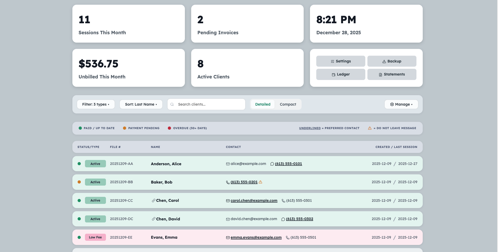
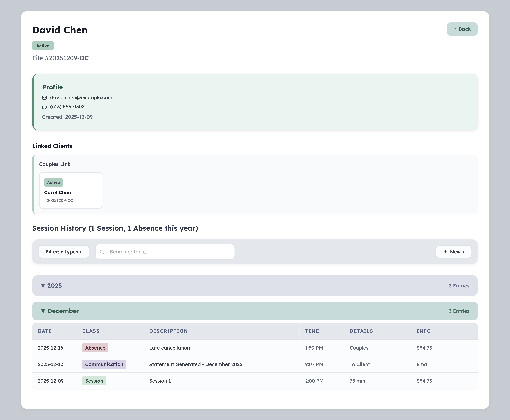

# EdgeCase Equalizer

Practice management software for independent therapists.

Web-based for convenience, but single-user and local-only by design. Your data stays yours.

**Website:** [edgecaseequalizer.ca](https://edgecaseequalizer.ca)

**Status:** Stable. In daily use by the author since January 2026.

## Downloads

Pre-built packages are available:

- **macOS** (Apple Silicon): [EdgeCase-1.0.0.dmg](https://edgecaseequalizer.ca/downloads/EdgeCase-1.0.0.dmg)
- **Linux** (Debian/Ubuntu x86_64): [edgecase_1.0.0_amd64.deb](https://edgecaseequalizer.ca/downloads/edgecase_1.0.0_amd64.deb)

Or run from source (see below).





*Screenshots show fictional test data.*

## Features

- Client records with encrypted database (SQLCipher)
- Session notes, communications, billing items
- PDF invoice generation with payment tracking
- Guardian billing for minor clients
- Couples/family/group therapy support
- Income and expense tracking
- Calendar integration (.ics export, Apple Calendar)
- Full backup/restore system
- Immutable clinical records with full edit history and redaction support
- Configurable retention periods with secure end-of-retention deletion
- Designed to support PHIPA compliance for solo practitioners
- Local AI assistant for session notes (optional)

## Requirements

- Python 3.11+ (3.13 recommended)
- macOS, Linux, or Windows

### macOS

```bash
brew install sqlcipher
export LDFLAGS="-L/opt/homebrew/opt/sqlcipher/lib"
export CPPFLAGS="-I/opt/homebrew/opt/sqlcipher/include"
```

### Linux (Debian/Ubuntu)

```bash
sudo apt install python3-venv python3-dev libsqlcipher-dev
```

### Windows

SQLCipher installation on Windows requires additional steps. See [sqlcipher3-wheels documentation](https://github.com/niccokunzmann/sqlcipher3-wheels).

## Installation

```bash
git clone https://github.com/rsembera/edgecase.git
cd edgecase
python -m venv venv
source venv/bin/activate  # On Windows: venv\Scripts\activate
pip install -e .
```

### With AI features (optional)

```bash
pip install -e ".[ai]"
```

## Running

```bash
python main.py
```

Then open http://localhost:8080 in your browser.

### Options

```bash
python main.py --port=9000    # Use a different port
python main.py --dev          # Development mode (auto-reload)
```

You can also set environment variables:

- `EDGECASE_PORT` - Port number (default: 8080)
- `EDGECASE_DATA` - Custom data directory (for testing or alternate databases)

## License

GNU Affero General Public License v3.0 (AGPL-3.0)

This ensures EdgeCase remains free software for therapists while preventing proprietary SaaS derivatives.

## Author

Richard Sembera
